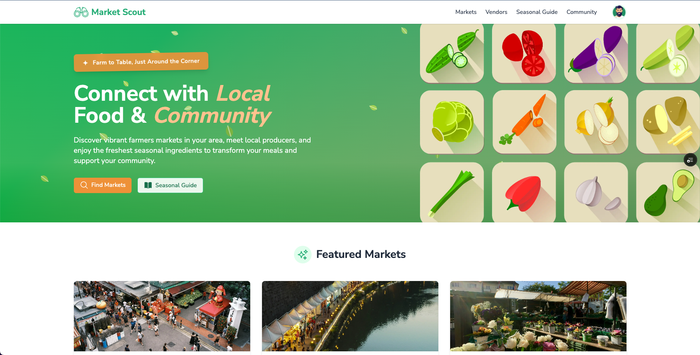

# 🌱 Market Scout

> Connect with local farmers markets and fresh produce in your neighborhood 🥕

## 🌿 Overview

Market Scout is an interactive web application that helps users discover local farmers markets, explore seasonal produce offerings, and connect with vendors in their area. Our user-friendly interface makes it easy to find fresh, locally-grown food while supporting small-scale agriculture.

Created for the 2nd Outlier Frontend UI Hackathon, this project focuses on delivering a beautiful, intuitive user experience for discovering local food systems.

## ✨ Features

- **Interactive Map**: Find farmers markets near you with an intuitive map interface
- **Market Profiles**: View detailed information about each market including hours, vendors, and amenities
- **Vendor Spotlights**: Discover local farmers and artisans with detailed profiles
- **Seasonal Calendar**: 🍓 Learn what produce is in season each month
- **Community Features**: Read reviews and find upcoming events at your favorite markets

## 🚀 Getting Started

### Prerequisites

- Node.js 18.17.0 or later
- npm or yarn

## 🛠️ Tech Stack

- **Framework**: [Next.js](https://nextjs.org/)
- **Language**: [TypeScript](https://www.typescriptlang.org/)
- **Styling**: [TailwindCSS](https://tailwindcss.com/)
- **Maps**: [Leaflet](https://leafletjs.com/)
- **Animation**: [Framer Motion](https://www.framer.com/motion/)

## 📱 Responsive Design

Market Scout is designed to work seamlessly across all devices:

- **Mobile**: Optimized for on-the-go market discovery
- **Tablet**: Perfect for browsing vendor profiles and planning market visits
- **Desktop**: Enhanced map experience and detailed market information

## 🌟 Key Components

- **MapView**: Interactive map interface for discovering markets
- **MarketDetails**: Comprehensive market information
- **VendorSpotlight**: Featured vendor profiles
- **SeasonalCalendar**: Interactive guide to seasonal produce 🍎
- **EventCards**: Upcoming market events and activities

## 🤝 Contributing

Contributions are welcome! Please feel free to submit a Pull Request.

1. Fork the repository
2. Create your feature branch (`git checkout -b feature/amazing-feature`)
3. Commit your changes (`git commit -m 'Add some amazing feature'`)
4. Push to the branch (`git push origin feature/amazing-feature`)
5. Open a Pull Request

## 📄 License

This project is licensed under the MIT License - see the LICENSE file for details.

## 🙏 Acknowledgements

- [Leaflet](https://leafletjs.com/) for the mapping functionality
- [Framer Motion](https://www.framer.com/motion/) for smooth animations
- [Heroicons](https://heroicons.com/) for beautiful icons
- All the local farmers and market organizers who inspire this project 🧑‍🌾
- Outlier.org for hosting the UI Hackathon that inspired this project

---

Made with ❤️ for local food systems | Outlier Frontend UI Hackathon 2025
